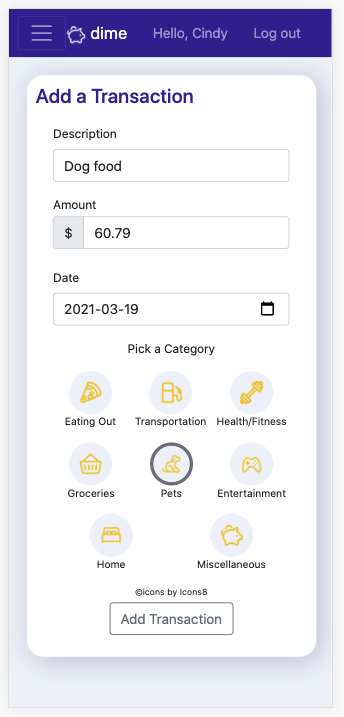

# dime

dime is a personal budgeting web app with a clean user interface, allowing users to stay on top of their budget while saving towards their financial goals.
 

dime was built in a week as the second project of my General Assembly immersive course.

## Features

- add, modify, and delete transactions
- search and filter transactions by keyword and category
- track daily progress towards savings goal
- view dashboard insights on monthly spend
- mobile, desktop, and tablet friendly

## Getting Started

[Try it out here!](https://mydime.herokuapp.com)

## Screenshots

|           Dashboard            |           Transactions            |
| :----------------------------: | :-------------------------------: |
|  |  |

|           Add Transaction            |           Profile            |           Goals            |
| :----------------------------------: | :--------------------------: | :------------------------: |
|  |  |  |

## Technologies Used

- HTML, CSS, JS
- Node JS, Express, MongoDB, Mongoose
- Bootstrap, Chart JS

## Next Steps

- add charts to compare spend per category per month
- add ability for user to customize transaction categories
- display chart labels on chart area
